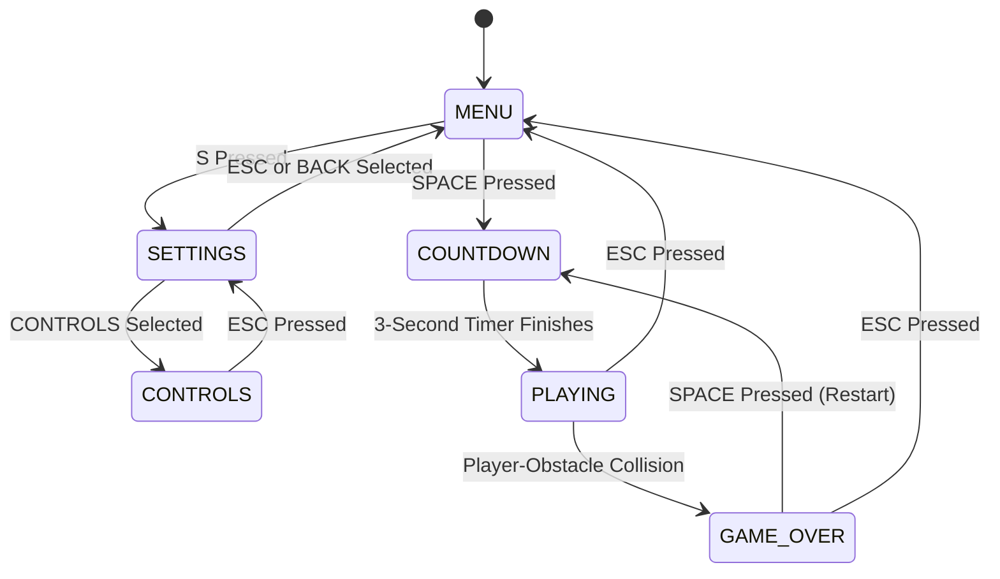
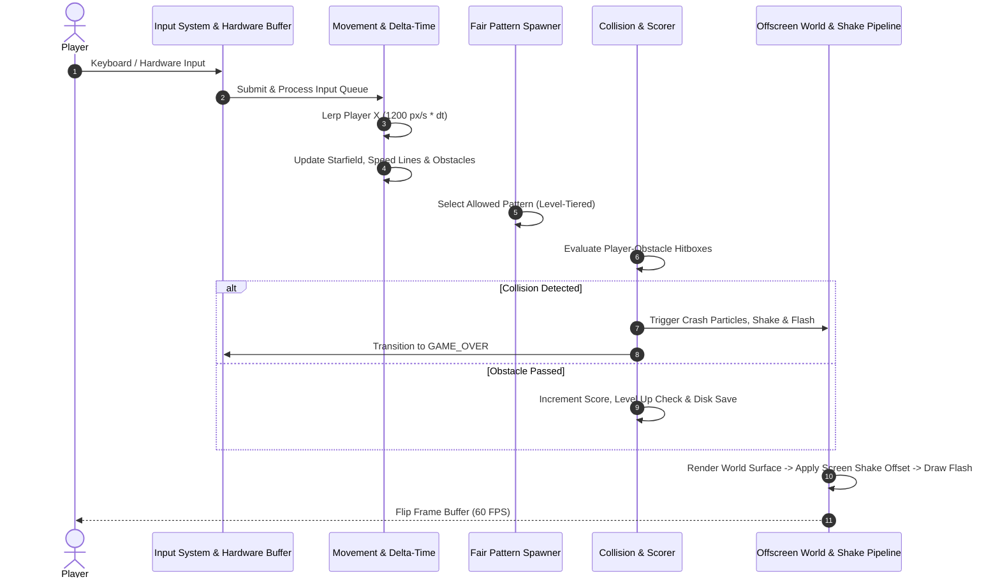

<div align="center">

  

  <br/><br/>

  <h1>⚡ S H I F T</h1>
  <p><strong>DODGE. SHIFT. SURVIVE.</strong></p>
  <p><em>An adrenaline-fueled, cyberpunk-themed 3-lane reflex obstacle dodger built with Python and Pygame.</em></p>

  <p>
    <a href="https://www.python.org/"></a>
    <a href="https://www.pygame.org/"></a>
    <a href="LICENSE"></a>
    
    
  </p>

  <p>
    <a href="#-key-features">Features</a> •
    <a href="#-game-architecture">Architecture</a> •
    <a href="#-controls--mechanics">Controls</a> •
    <a href="#-difficulty-progression">Difficulty Curve</a> •
    <a href="#-installation--quickstart">Installation</a> •
    <a href="#-deployment">Deployment</a> •
    <a href="PROGRESS.md">Dev Progress Log</a>
  </p>

</div>

---

## 🌌 Overview

**SHIFT** places you in the cockpit of a glowing high-speed cyber-vehicle traversing an infinite neon speedway. Obstacles cascade in accelerating frequencies across three lanes. Your objective is pure reflex survival: switch lanes, avoid barricades, navigate multi-lane blockades, and climb the high-score leaderboard.

Designed with **delta-time physics**, **procedural sine-wave audio synthesis**, **particle physics**, and **fair spawning algorithms**, SHIFT delivers fluid, frame-rate-independent arcade action that scales dynamically with your score.

<div align="center">
  
</div>

---

## ✨ Key Features

- 🏎️ **Continuous Smooth Interpolation**: Smooth lane transitioning physics ($1200\text{ px/s}$) with responsive target dampening.
- ⚙️ **Interactive Settings & Audio Toggle**: Full in-game Settings menu allowing you to toggle synthesized sound effects, inspect controls, and navigate menus.
- 🧠 **Fair Spawning Heuristics & Pattern Memory**: Guarantees at least one open escape lane at all times while preventing repetitive patterns.
- 📈 **Dynamic Difficulty Tiers (Levels 1–10)**: Real-time velocity acceleration from $300\text{ px/s}$ to $750\text{ px/s}$ with spawn intervals tightening down to $0.45\text{s}$.
- 💥 **Visual Impact Feedback**: Directional camera screen shake, red impact flash overlay, and gravity-driven particle explosion bursts.
- 🌌 **Atmospheric Starfield & Speed Lines**: 80 depth-scrolling background stars and 20 neon speed lines for high-velocity immersion.
- 💾 **Disk High-Score Persistence**: Automatic session and disk high-score tracking via `highscore.txt`.
- 🔌 **Hardware Controller Ready**: Abstracted input queue architecture with hooks for Arduino, ESP32, and Bluetooth hardware inputs.

---

## 📐 Game Architecture

SHIFT is built on a modular finite state machine:

### 1. State Machine Flow


### 2. Frame Execution Pipeline


---

## 🎮 Controls & Keybindings

| Keybinding | Action | Context |
| :--- | :--- | :--- |
| <kbd>A</kbd> or <kbd>←</kbd> | **Shift Left** | In-Game (`PLAYING`) |
| <kbd>D</kbd> or <kbd>→</kbd> | **Shift Right** | In-Game (`PLAYING`) |
| <kbd>SPACE</kbd> | **Start Game / Quick Restart** | Menu / Game Over |
| <kbd>S</kbd> | **Open Settings** | Main Menu (`MENU`) |
| <kbd>↑</kbd> / <kbd>↓</kbd> or <kbd>W</kbd> / <kbd>S</kbd> | **Navigate Settings** | Settings Menu (`SETTINGS`) |
| <kbd>ENTER</kbd> | **Toggle Sound / Select Option** | Settings Menu (`SETTINGS`) |
| <kbd>ESC</kbd> | **Back / Quit to Menu** | Global |

---

## 📊 Difficulty Scaling

The difficulty system dynamically scales obstacle speeds and spawn frequencies based on current score:

| Level | Score Range | Obstacle Speed | Spawn Interval | Hazard Distribution |
| :---: | :---: | :---: | :---: | :--- |
| **1** | 0 – 4 | $300\text{ px/s}$ | $1.25\text{ s}$ | Single Hazards (Tutorial) |
| **2** | 5 – 9 | $350\text{ px/s}$ | $1.17\text{ s}$ | Single Hazards (Accelerating) |
| **3** | 10 – 14 | $400\text{ px/s}$ | $1.09\text{ s}$ | Dual Barricades Introduced |
| **4** | 15 – 19 | $450\text{ px/s}$ | $1.01\text{ s}$ | Dual Barricades & Rapid Lane Traps |
| **5** | 20 – 24 | $500\text{ px/s}$ | $0.93\text{ s}$ | Advanced Mixed Patterns |
| **6+** | 25+ | Up to $750\text{ px/s}$ | Down to $0.45\text{ s}$ | Maximum Reflex Intensity |

---

## 🚀 Installation & Quickstart

### Prerequisites
- **Python 3.10** or higher
- **Git**

### 1. Clone the Repository
```bash
git clone https://github.com/Snigdha-0210/Shift.git
cd Shift
```

### 2. Set Up Virtual Environment

#### On Windows (PowerShell):
```powershell
python -m venv .venv
.\.venv\Scripts\Activate.ps1
```

#### On macOS / Linux:
```bash
python3 -m venv .venv
source .venv/bin/activate
```

### 3. Install Dependencies
```bash
pip install -r requirements.txt
```

### 4. Launch the Game
```bash
python main.py
```

---

## 🌐 Deployment Options

### 1. Web Browser Deployment (Pygbag / WebAssembly)
You can deploy SHIFT to run in any web browser without installation:
```bash
pip install pygbag
pygbag .
```
Open `http://localhost:8000` to test in your browser. This can be published directly to **GitHub Pages** or **Itch.io**.

### 2. Standalone Windows Desktop App (`.exe`)
To package SHIFT as a portable Windows `.exe` that anyone can double-click to play:
```bash
pip install pyinstaller
pyinstaller --onefile --noconsole --name "SHIFT" main.py
```
Your standalone game executable will be generated in the `dist/` folder!

---

## 📁 Project Structure

```text
SHIFT/
├── assets/
│   ├── banner.jpg          # Repository header & promotional banner
│   └── icon.jpg            # Cyberpunk game badge & application icon
├── .gitignore              # Git ignore rules for Python, virtual environments & IDEs
├── CONTRIBUTING.md         # Open-source contribution guidelines
├── LICENSE                 # MIT Open-Source License
├── PROGRESS.md             # Developer progress log & roadmap notes
├── README.md               # Repository documentation
├── requirements.txt        # Pinned Python package dependencies
├── sync.ps1                # One-click PowerShell Git push automation
├── highscore.txt           # Local high score persistence file
└── main.py                 # Core game loop, rendering engine & state logic
```

---

## 📄 License

This project is licensed under the **MIT License** — see the [LICENSE](LICENSE) file for details.

---

<div align="center">
  <sub>Built with ❤️ and Pygame by <a href="https://github.com/Snigdha-0210">Snigdha</a>. Star ⭐ the repository if you enjoy playing!</sub>
</div>
