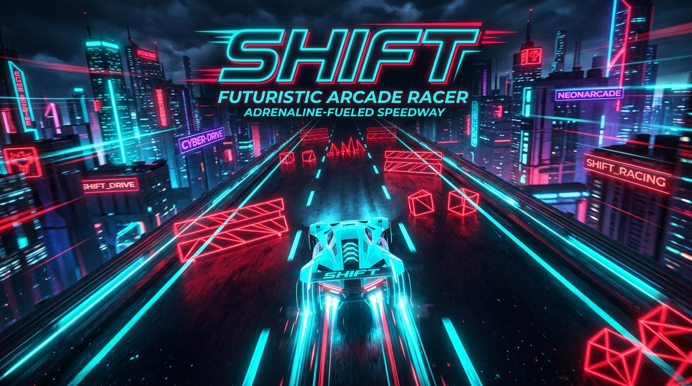
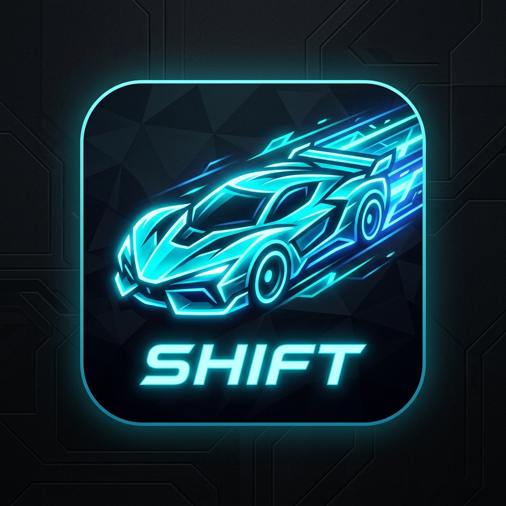
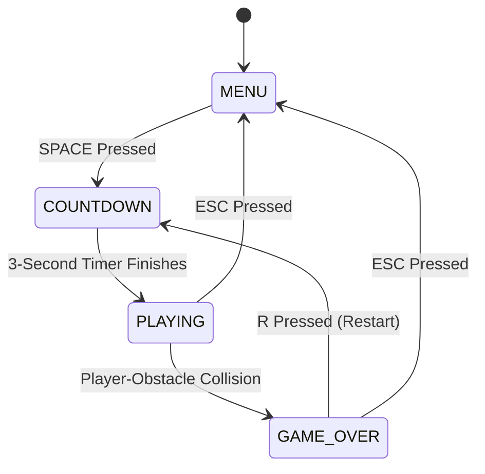
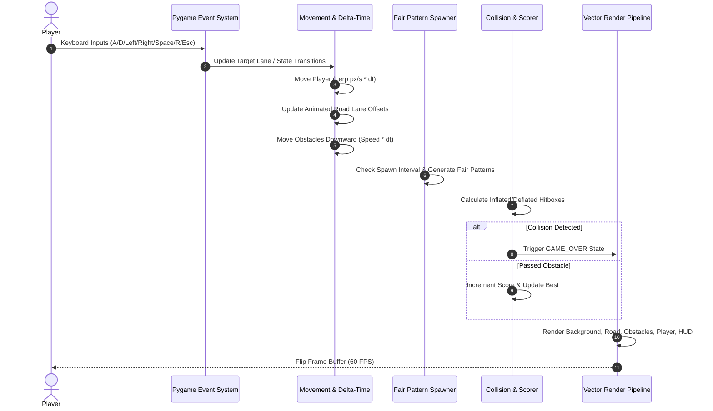

<div align="center">

  

  <br/><br/>

  <h1>⚡ S H I F T</h1>
  <p><strong>DODGE. SURVIVE. SHIFT.</strong></p>
  <p><em>An adrenaline-fueled, cyberpunk-themed 3-lane reflex obstacle dodger built with Python and Pygame.</em></p>

  <p>
    <a href="https://www.python.org/"></a>
    <a href="https://www.pygame.org/"></a>
    <a href="LICENSE"></a>
    
    
  </p>

  <p>
    <a href="#-key-features">Features</a> •
    <a href="#-game-architecture">Architecture</a> •
    <a href="#-controls--mechanics">Controls</a> •
    <a href="#-difficulty-progression">Difficulty Curve</a> •
    <a href="#-installation--quickstart">Installation</a> •
    <a href="#-project-structure">Project Structure</a> •
    <a href="#-roadmap">Roadmap</a>
  </p>

</div>

---

## 🌌 Overview

**SHIFT** places you in the cockpit of a glowing high-speed cyber-vehicle traveling down a futuristic neon transit corridor. Obstacles drop in increasingly rapid succession across three lanes. Your objective is pure reflex survival: switch lanes, avoid hazard barriers, navigate multi-lane barricades, and climb the high-score leaderboard.

Designed with **delta-time physics**, **procedural vector graphics**, and **fair spawning algorithms**, SHIFT delivers fluid, frame-rate-independent arcade action that scales dynamically with your performance.

<div align="center">
  
</div>

---

## ✨ Key Features

- 🏎️ **Continuous Smooth Interpolation**: Unlike rigid grid-snapping games, your vehicle transitions between lanes with continuous acceleration and velocity dampening (900 px/s).
- 🧠 **Fair Spawning Heuristics**: The obstacle spawner inspects player position and enforces reachability constraints, guaranteeing every obstacle pattern has an achievable escape route.
- 📈 **5-Tier Adaptive Difficulty Curve**: Speeds dynamically ramp up from 300 px/s to 500 px/s while spawn timers compress from 1.20s down to 0.70s alongside dual-obstacle barricade patterns.
- 🎨 **Pure Procedural Neon Graphics**: 100% hardware-accelerated code rendering—glowing vehicle silhouettes, windshield reflections, hazard warning stripes, and animated road markers without third-party bitmap dependencies.
- ⏱️ **Delta-Time Frame Independence**: Game physics and animations operate strictly on `dt` increments, ensuring identical game speed across diverse hardware monitors (60Hz, 144Hz, 240Hz).
- 🏆 **Integrated Score & High-Score Tracking**: Real-time HUD scoring, automated high-score persistence during the session, and animated restart loops.

---

## 📐 Game Architecture

SHIFT is structured around a modular, deterministic state machine and game loop:

### 1. State Machine Flow


### 2. Frame Execution Pipeline


---

## 🎮 Controls & Mechanics

| Keybinding | Action | Context |
| :--- | :--- | :--- |
| <kbd>A</kbd> or <kbd>←</kbd> | **Shift Left** | In-Game (`PLAYING`) |
| <kbd>D</kbd> or <kbd>→</kbd> | **Shift Right** | In-Game (`PLAYING`) |
| <kbd>SPACE</kbd> | **Start Game / Launch Countdown** | Main Menu (`MENU`) |
| <kbd>R</kbd> | **Quick Restart** | Game Over (`GAME_OVER`) |
| <kbd>ESC</kbd> | **Return to Main Menu** | Playing / Game Over |

### 🎯 Hitbox Precision Engineering
To reward clutch maneuvers, the player vehicle uses an adjusted inner collision volume:
- **Visual Vehicle Dimensions**: 80 × 100 px
- **Collision Hitbox**: Centered (w - 16) px × (h - 10) px with edge tolerance, allowing pixel-tight evasions through dual barricades.

---

## 📊 Difficulty Progression

The difficulty system dynamically assesses your current score and scales both obstacle velocity and density:

```mermaid
gantt
    title Difficulty Level Scaling by Score
    dateFormat X
    axisFormat %s

    section Level 1 (Score 0-4)
    300 px/s | 1.20s Spawn : 0, 5
    section Level 2 (Score 5-9)
    350 px/s | 1.05s Spawn (25% Double) : 5, 10
    section Level 3 (Score 10-14)
    400 px/s | 0.90s Spawn (40% Double) : 10, 15
    section Level 4 (Score 15-19)
    450 px/s | 0.80s Spawn (40% Double) : 15, 20
    section Level 5 (Score 20+)
    500 px/s | 0.70s Spawn (50% Double) : 20, 30
```



| Level | Score Range | Obstacle Speed | Spawn Interval | Hazard Type Distribution |
| :---: | :---: | :---: | :---: | :--- |
| **1** | 0 – 4 | 300 px/s | 1.20 s | 100% Single Obstacle |
| **2** | 5 – 9 | 350 px/s | 1.05 s | 75% Single, 25% Double |
| **3** | 10 – 14 | 400 px/s | 0.90 s | 60% Single, 40% Double |
| **4** | 15 – 19 | 450 px/s | 0.80 s | 60% Single, 40% Double |
| **5** | 20+ | 500 px/s | 0.70 s | 50% Single, 50% Double (Maximum Intensity) |

---

## 🎨 Color Palette & Design Tokens

SHIFT uses a curated neon-synthwave cyberpunk palette:

| Token | Hex / RGB | Role |
| :--- | :--- | :--- |
| `BACKGROUND` | `rgb(10, 12, 18)` | Deep void background |
| `ROAD_COLOR` | `rgb(42, 44, 50)` | Asphalt highway surface |
| `PLAYER_COLOR` | `rgb(0, 220, 255)` | Electric cyan chassis & glows |
| `OBSTACLE_COLOR`| `rgb(220, 55, 55)` | Crimson hazard core |
| `WARNING_COLOR` | `rgb(255, 190, 40)` | High-voltage warning stripes |
| `HUD_PANEL` | `rgb(20, 23, 30)` | Translucent HUD panels |

---

## 🚀 Installation & Quickstart

### Prerequisites
- **Python 3.10** or higher
- **Git**

### 1. Clone the Repository
```bash
git clone https://github.com/Snigdha-0210/Shift.git
cd Shift
```

### 2. Set Up Virtual Environment

#### On Windows (PowerShell):
```powershell
python -m venv .venv
.\.venv\Scripts\Activate.ps1
```

#### On macOS / Linux:
```bash
python3 -m venv .venv
source .venv/bin/activate
```

### 3. Install Dependencies
```bash
pip install -r requirements.txt
```

### 4. Launch the Game
```bash
python main.py
```

---

## 📁 Project Structure

```text
SHIFT/
├── assets/
│   ├── banner.jpg          # Repository header & promotional banner
│   └── icon.jpg            # Cyberpunk game badge & application icon
├── .gitignore              # Git ignore rules for Python, virtual environments & IDEs
├── CONTRIBUTING.md         # Open-source contribution guidelines
├── LICENSE                 # MIT Open-Source License
├── README.md               # Repository documentation
├── requirements.txt        # Pinned Python package dependencies
└── main.py                 # Core game loop, rendering engine & state logic
```

---

## 🛣️ Roadmap & Future Enhancements

- [ ] 🎵 **Chiptune & Synthwave Audio Engine**: Dynamic background music that accelerates with difficulty tiers and spatial lane-shift SFX.
- [ ] ✨ **Particle Glow System**: Neon tire sparks, afterburners, and crash explosion particles.
- [ ] ⚡ **Power-Up Pickups**:
  - 🛡️ *Shield Barrier* (Absorbs 1 collision)
  - ⏱️ *Time Dilation / EMP* (Slows down obstacles for 4 seconds)
  - 💎 *Score Multipliers* (Double points for close dodges)
- [ ] 🚗 **Vehicle Customization**: Unlockable color schemes and aerodynamic chassis.
- [ ] 🌐 **Global Web Leaderboard**: Cloud API integration for cross-platform high-scores.

---

## 🤝 Contributing

Contributions are warmly welcome! Whether fixing bugs, optimizing vector render routines, or contributing sound effects:

1. Check out [CONTRIBUTING.md](CONTRIBUTING.md) for full guidelines.
2. Fork the repository and create a feature branch (`git checkout -b feature/cool-feature`).
3. Commit your enhancements (`git commit -m 'feat: add neon trail particles'`).
4. Push to your branch and open a Pull Request!

---

## 📄 License

This project is licensed under the **MIT License** — see the [LICENSE](LICENSE) file for details.

---

<div align="center">
  <sub>Built with ❤️ and Pygame by <a href="https://github.com/Snigdha-0210">Snigdha</a>. Star ⭐ the repository if you enjoyed playing!</sub>
</div>
